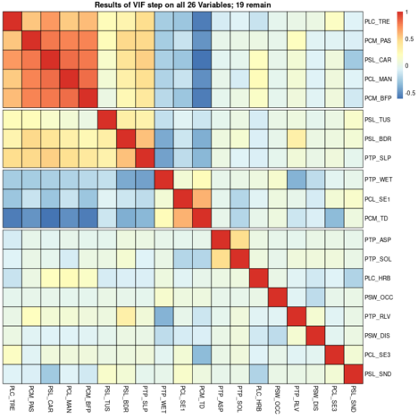

<style>

slide.title-slide h2 {
  text-align: left;
  color: #4E2A84;		
  line-height: 1.2;
}

slide.backdrop {
  background: black;
}

body {
  background-color: black;
}
h2 { 
 text-align: right;
 color: #4E2A84;		
}

h3 { 
 color: #3399ff;		
}
</style>

```{r setup, include=FALSE}
knitr::opts_chunk$set(echo = FALSE)
```

```{r}
source('functions.R')
```


## talk overview

- Applications  

- Objectives

- Methods

- Interpretation

##  applications - conservation  

- aid in discovery of new populations of imperiled plants

- aid in creation of reserves under climate change models

- aid in predicting joint species distributions, i.e. obligate mutualisms 

## applications - academic

- fine scale models to study co-existence
- develop candidate species for metabarcoding

## objectives {.build}

using known occurrences of a species, identify areas which have
similar habitat and the potential to support populations 

but, what about dispersal?  

competition?  

mutualisms?  

## an example species to accompany our study

 [*Besseya* (=*Synthris*) *alpina* (A. Gray) Rydberg.](http://floranorthamerica.org/Synthyris_alpina)
 
<div class="columns-2">


{width=75% height=75%}

{width=75% height=75%}
</div>

<div class="notes">

As an example species, we are going to use one that i modelled as a portion of masters work. *Besseya alpina*, alpine kittentails, is a part of the Plantaginaceae and closely aligned with *Veronica*. This species is endemic to Western North America, and it is confined entirely to rocky or stony fellfields in the alpine. as would be seen 

</div>

## methods - overview {.build}

define spatial domain and grain

software environments

dependent variables

independent variables

modelling approaches

model evaluation

predicting a model into space

## domain and grain {.build .flexbox .vcenter}

domain; spatial extent of study  
  - administrative boundary   
  - ecological model 
    
grain; scales in space and time  
- resolution at which process occurs (space)    
- current and past climate (time)    
- projected climates    
- (animals) seasonal patterns?     

limitation: compute power  

<div class="notes">

The first few steps in your analysis is to reasonably define a few parameters. It is easy to get carried away when you do not have to collect field data yourself, and try to perform analyses at enormous spatial scales, or at very very fine details.

Remember the 'domain' is the spatial extent over which we are interested in studying a process. Generally, these are defined by funding agencies, e.g. for all of my normal office work, I use extents of land ownership; a form of administrative boundary. For academic work, depending on how the funding comes through, we may be much more likely to use domains informed by ecological processes. Examples would be a floristic province, or an ecoregion concept. 

Grain is the resolution of an event in both time and space. For a spatial grain, you want to gather predictor variables which are able to correlate well with your species. For example day length in spring for plants, will only vary substantially over quite large scales. Elevation at a scale of 1 meter, rather than a more coarse surface would contain much meaningless variation. So we must balance these; however, most publicly available spatial data come only at a few resolutions (800m^2^, 1000m^2^, or 4000m^2^).

Temporal grain is very important for migratory animals, it is also very important if you want to see a species distribution before climate change effects, and after, and if you want to project your results into the future under climate change projections. 

It sounds like you will have many options to sort through here, but no! You are informed by computer power, you do what you can, just like with fieldwork. 

</div>

## domain and grain {.flexbox .vcenter}

{height=100%}


<div class="notes">

Our species Besseya alpina is endemic to the Southern Rocky Mountains. During this modelling endeavor we will do what most Species distribution modellers do and model the whole range. As we see here, we have a focal area, in greenish blue, which constitutes an Ecological Region, an area with a clustered set or properties. We then buffer this area by a moderate amount, around 100 kilometers, and we have established a domain. 

</div>


## software environments

- **R**
  - **caret** *data partitioning* @kuhn2022caret
  - **sf** *vector data ala tidyverse* @pebesma2018sf
  - **terra** *raster data without headaches* @hijman2022terra
  - **sdm** *modelling operations*  @naimi2016sdm
  
- **grass gis** *many modules for creating predictors*

- **qgis** *graphical user interface for mouse guided visualization*

<div class="notes">

There are a handful of options which exist for generating species distribution models and processing geographic information systems data. I can only advocate the use of open source software, as this allows others to benefit and reproduce our research without considerable fiscals resources. Furthermore, open source alternatives are generally much better than paid software. As species distribution models are really all about the statistics, R, is an un- paralled software to generate SDM's in, and will keep your notes for you! However, grass gis offers several modules, all of which are accessible from the command line, which create useful spatial data products. Likewise QGIS is a really great lightweight GIS with a super friendly graphical user interface which you can use to visualize your predictor variables more dynamically than the experience offered by R and Rstudio. 

We rely heavily on the sdm package, which is one of the best examples of *object orientated programming* which I have seen in R, and is capable of loading in statistical methods from nearly any R package you want! For example if you want any flavor of linear models you can import new methods from any Ben Bolker package you want! 

</div>
    
## dependent variables - presences

- occurrences of a species in space *(and time)*

- Linear models:
  - check for spatial autocorrelation using Morans I
  - sampling artefact? remove samples
  - thin points piecewise by most offending record

```{r}
knitr::include_graphics('../graphics/BIEN.png')
knitr::include_graphics('../graphics/GBIF.png')
```

## dependent variables - presences  example {.flexbox .vcenter}

{height=100%}

<div class="notes">

In general, when it comes to rare species your only sources of occurrence records are going to be from herbaria, and subsequent targeted sampling for that species, or surveying for  an entirely rare habitat type which this and other species occur in. Usually, for these records you want to work with a Natural Heritage Program, or Natural History Survey; they tend to specialize in these surveys and maintenance of these records.  

For more common species, you are able to now glean considerable amounts of information from citizen science resources; although these tend to be phenotypically biased towards pretty flowers, at the expense of truly gorgeous flowers such as those in groups like the Sedges. 

</div>


## dependent variables - absences

- optional: pseudoabsences space *(and time)*
- more optional: absences space *(and time)*

<div class="columns-2">

- presence:absence records  
  - linear models - 1:*many*  
  - machine learning - 1:1  
- distance between presences
  - geographic
  - environmental
  
  

</div>
  
```{r}

```


## dependent variables - absences example {.flexbox .vcenter}


## independent variables

- variables relating to *patterns* in biotic distribution 
  - relevant to *your* extent and grains 
  - require *variation* 
  - no focus on factors governing biological *processes*, rather features which
  *correlate* with the known species distribution
- limitation: compute power
  
## independent variables - examples

- domain: continental (e.g. North America)
  - maximum and minimum daily temperatures, precipitation amount and form, hydrologic drainage
- domain: regional (e.g. Southern Rockies)
  - elevation, soil classes, solar radiation
- domain: fine (e.g. East River Valley)
  - micro topography, water relations, shade, soils, species compositions
  
## variance in independent variables

<div class="columns-2">

  - explicitly check for variation
  
  - carefully encode categorical data
  
  - too much, may not be useful
  
  - too little, may not be useful
  
  - pilot knock out studies; use one variable leaving the others out
  
  - warrants simplifying a variable?
  
  
</div>

## modelling approaches - overview

- ensembles pt. I & II
- linear models
  - assumptions - dependent variables (IV)
  - assumptions - independent variables (DV)
  - modelling
    - model evaluation
  - machine learning
    - assumptions ?
    - modelling
      - model evaluation
- ensembles pt. III

## ensembles pt I

- problems with all models
  - garbage in -> garbage out
  - influential outliers
- with machine learning; 
  - models can fixate on these observations
  
- solution:
  - run many models, synthesize the results
  
> *"we are stronger together than we are alone"* - Walter Payton

## ensembles pt II

- implementations:
  - weak learners; many simple decision tree models are combined to a single output
    - bootstrap aggregation (**bagging**) e.g. *random forests*
      - many models run independent of each  
    - **boosting** e.g. *boosted regression trees*
      - many models run sequentially, focusing on correcting errors in the last iteration
      
  - *stacking* another form of combining many models
    - can accommodate the consensus output from bagged, boosted, or traditional linear models
  
## linear models

- commonly implemented:
  - *generalized linear models* (glms)
  - *generalized additive models* (gams)

## linear models - assumptions DV

## linear models - assumptions IV

<div class="columns-2">
  - Variance inflation
  - identify correlated variables
  - pilot knock out studies; use one variable leaving the others out
  
  
</div>


## modelling process

all evaluation performed by computer -- too much information

## machine learning 

much more common approach than individual linear models

species distributions are generally too complex for individual predictors, and building
fully interactive terms would take a long time.

the typical approach since the late 90's

do the work for you

## machine learning - assumptions

none, get a few observations, the more the merrier.

## modelling

train/test split (partition data)

- no free lunch 
  - no silver bullet machine learning algorithm; each is able to work better than 
  others under diverse circumstances.
  - try many types of models, select some that work for *your* application

- commonly implemented:
  - random forest 
  - maximum entropy (maxent)

## evaluation I

$$ Accuracy = \frac{\text{correct classifications}}{\text{all classifications }} $$
$$ Sensitivity = \frac{\text{true positives}}{\text{true positives + false negatives }} $$ probability of the method giving a positive result when the test subject is positive.

$$ Specificity = \frac{\text{true negatives}}{\text{true negatives + false positives }} $$ probability of the method giving a negative result when the test subject is negative  

## evaluation II 

- Area Under the ROC Curve (AUC)  
- True Skill Statistic (TSS)  
  - unequal sample sizes, i.e. evaluate many models at once  
- Cohen's kappa

## ensembles pt II

- several r packages offer *stacking* of many models, based on your selection 
of evaluation criteria to weigh them
- the 'test' partition of your data are used to evaluate this final model

## predicting a model into space 

- any model, based on values present in gridded (raster) data can be predicted onto a new raster surface
- each covariate in the model, is generally a single raster layer
- r packages, such as *terra*, do all the work for you
- accordingly, species distribution models create a map as a product

## interpretation

<div class="columns-2">
  - percent suitability of habitat
  - of each cell - not proportion of cell
  - based on your model
  
  
</div>


## tips and tricks

- keep a lab notebook; experiments *in silico* ala experiments *in vitro*

## conclusion

- species distribution models are very simple!
- fun introduction to simple machine learning
- represent a hypothesis of the probability of suitable habitat
- new avenues (J-SDM's) can include mutualisms
- stacked species (S-SDM's) distributions for predicting ecological assemblies

## contact info

- github/sagesteppe (preferred)
- reedbenkendorf2021@u.northwestern.edu


## some extra info 

## modelling ensemble learning

> __Ensemble learning__ utilizes many sets of trees, each tree being composed of many binary decisions, to create a single model. Each independent variable ( - or *feature*) may become a node on the tree - i.e. a location on the tree where a binary decision will move towards a predicted outcome. Each of the decision tree models which ensemble learning utilizes is a weak model, each of which may suffer due to high variance or bias, but which produce better outcomes than would be expected via chance. When ensembled these models generate a strong model, a model which should have more appropriately balanced variance and bias and predicts outcomes which are more strongly correlated with the expected values than the individual weak models. 

## modelling random forest

> *__Random Forest (RF)__* the training data are continually bootstrap re-sampled, in combination with random subsets of features, to create nodes which attempt to optimally predict a known outcome. A large number of trees are then aggregated, via the most common predictions, to generate a final classification prediction tree. Each individual prediction tree is generated independently of the others. 

## modelling boosted regression trees

> *__Boosted Regression Tree (BRT)__* (or Gradient Boosted tree) An initial tree is grown, and all other trees are derived sequentially from it, as each new tree is grown the errors in responses from the last tree are weighed more heavily so that the model focuses on selecting dependent variables which refine predictions. All response data and predictor variables are kept available to all trees.

## citations
