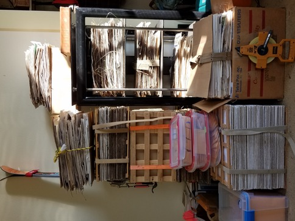
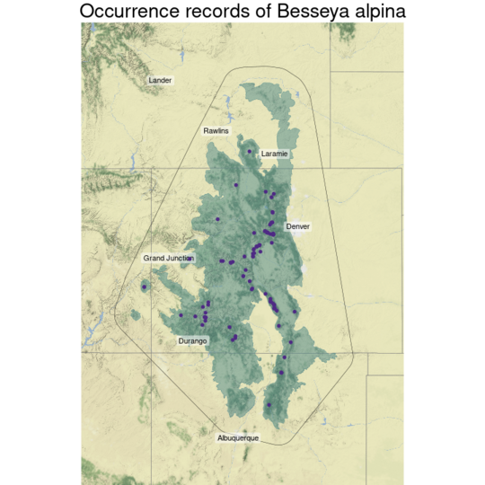
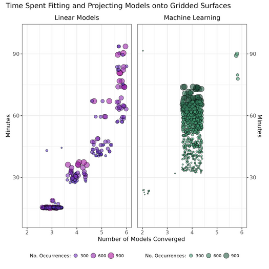

<style>

slide.title-slide h1 {
  font-size: 2.0em;
  line-height: 1.5;
}

slide.title-slide h2 {
  font-size: 1.0em;
  text-align: left;
  color: #4E2A84;		
  line-height: 1.2;
}

slide.backdrop {
  background: black;
}

body {
  background-color: black;
}

h2 { 
 text-align: right;
 color: #4E2A84;		
}

h3 { 
 color: #3399ff;		
}
</style>

```{r setup, include=FALSE}
knitr::opts_chunk$set(echo = FALSE)
```

```{r}
source('functions.R')
```

<div class="notes">


</div>


<div class="notes">
    Our general talk is going to follow this formula. We are basically just going to go over the really broad aspects of a model, so that if you are interested in generating one, you have something of road map for the process. 

Our talk is going to have mostly, theory, with an example species which pops up here and there throughout it; but you really can't count on habitual examples here. 
</div>

## talk overview {.flexbox .vcenter}

- applications  

- objectives

- methods

- interpretation


##  applications - conservation  

- aid in discovery of new populations of imperiled plants  (@franklin2010mapping)

- aid in creation of reserves under climate change models  

- aid in predicting joint species distributions, i.e. obligate mutualisms   

- aid in modelling spread of noxious species to novel ranges (but see @liu2020species)  

<div class="notes">
Species Distribution Models, are most commonly used in the whole *Conservation* side of this whole *Plant Biology* thing - they are also popular for other kingdoms.  Essentially, these models are hypotheses of where we expect to find a species across the landscape. They are largely developed for rare species, which by definition are hard to find, and help conservation biologists in directing resources towards having success in those regards. Historically they were quite simply, to find a single rare species, but now they are oftentimes used for considering reserve design under climate change, and with some obligate mutualists, for example if anyone is familiar with Dr. Fants work regarding *Brighamia insignis* and hawkmoths that would be a use case. They are also occasionally used in invasion biology, but many caveats with this exist. 
</div>

## applications - academic

- develop candidate species for metabarcoding
- fine scale models to study co-existence
- used in population biology (but see @LeeYaw2022species)

<div class="notes">
These models have also gained some popularity in academic research as well, for applications aside from those we have already mentioned. For my research we utilized species distribution models to build custom sequence reference databases to identify pollen grains which were collected by bees and adhered to there bodies. They are now occasionally investigated by researchers interested in studying the co-existing of species in re-occuring assemblages. They are also used commonly in population biology, but many caveats exist with this.
</div>

## objectives {.build}

using known occurrences of a species, identify areas which have
similar habitat and the potential to support populations 

but, what about dispersal?  

competition?  

mutualisms?  

<div class="notes">
To reiterate, the purpose of a species distribution model is to predict a hypothesis of areas where a species may occur, given known occurrences as response, and environmental variables as predictors variables. 

These models speak little to limitation of colonization by dispersal. 

They speak little to exclusion of a population due to competition

They are now able to accommodate some information on obligate mutualisms.
</div>

## an example species to accompany our study

 [*Besseya* (=*Synthris*) *alpina* (A. Gray) Rydberg.](http://floranorthamerica.org/Synthyris_alpina)
 
<div class="columns-2">


{width=75% height=75%}

{width=75% height=75%}
</div>

<div class="notes">

As an example species, we are going to use one that i modelled as a portion of masters work. *Besseya alpina*, alpine kittentails, is a part of the Plantaginaceae and closely aligned with *Veronica*. This species is endemic to Western North America, and it is confined entirely to rocky fields or stony fellfields in the alpine. as would be seen in the background of this image along the ridges. 

</div>

## methods - overview {.build .flexbox .vcenter}

define spatial domain and grain

software environments

dependent variables

independent variables

modelling approaches

model evaluation

predicting a model into space

<div class="notes">

the general steps for creating species distribution models are generally pretty similar as for most other projects. One of the real first pieces of information to work towards figuring out is how much computer power you have, and that will inform the domain and grains. Generally who you are working with, or what experience with software you have wil determine the environments you are using. Acquiring species records, and the independent variables can take some review time, but both are now largely available at specialized databasea for them. The choices of modelling approaches to attempt again come largely down to personal experience and familiarity with a type of model or algorithms. Evaluation kind of comes down to where you would feel the least bad about being wrong; do you want to over or under predict? What are the consequences of preding a false presence? 

</div>

## domain and grain {.build .flexbox .vcenter}

**domain**; spatial extent of study  
  - administrative boundary   
  - ecological model 
    
**grain**; scales in space and time  
- resolution at which process occurs (space)    
- current and past climate (time)    
- projected climates    
- (animals) seasonal patterns?     

limitation: compute power  

<div class="notes">

The first few steps in your analysis is to reasonably define a few parameters. It is easy to get carried away when you do not have to collect field data yourself, and try to perform analyses at enormous spatial scales, or at very very fine details.

Remember the 'domain' is the spatial extent over which we are interested in studying a process. Generally, these are defined by funding agencies, e.g. for all of my normal office work, I use extents of land ownership; a form of administrative boundary. For academic work, depending on how the funding comes through, we may be much more likely to use domains informed by ecological processes. Examples would be a floristic province, or an ecoregion concept. 

Grain is the resolution of an event in both time and space. For a spatial grain, you want to gather predictor variables which are able to correlate well with your species. For example day length in spring for plants, will only vary substantially over quite large scales. Elevation at a scale of 1 meter, rather than a more coarse surface would contain much meaningless variation. So we must balance these; however, most publicly available spatial data come only at a few resolutions (800m^2^, 1000m^2^, or 4000m^2^).

Temporal grain is very important for migratory animals, it is also very important if you want to see a species distribution before climate change effects, and after, and if you want to project your results into the future under climate change projections. 

It sounds like you will have many options to sort through here, but no! You are informed by computer power, you do what you can, just like with fieldwork. 

</div>

## domain and grain {.flexbox .vcenter}

{height=100%}

<div class="notes">

Our species Besseya alpina is endemic to the Southern Rocky Mountains. During this modelling endeavor we will do what most Species distribution modellers do and model the whole range. As we see here, we have a focal area, in greenish blue, which constitutes an Ecological Region, an area with a clustered set or properties. We then buffer this area by a moderate amount, around 100 kilometers, and we have established a domain. 

</div>


## software environments
<div class="columns-2">
- **R**
  - **sf** *vector data ala tidyverse* @pebesma2018sf
  - **terra** *raster data without headaches* @hijman2022terra
  - **sdm** *modelling operations*  @naimi2016sdm
  - **caret** *ML / data partitioning* @kuhn2022caret
- **grass gis** *many modules for creating predictors*
- **qgis** *graphical user interface for mouse guided visualization*


{height=50%, width=50%}

</div>

<div class="notes">

There are a handful of options which exist for generating species distribution models and processing geographic information systems data. I can only advocate the use of open source software, as this allows others to benefit and reproduce our research without considerable fiscals resources. Furthermore, open source alternatives are generally much better than paid software. As species distribution models are really all about the statistics, R, is an un- paralled software to generate SDM's in, and will keep your notes for you! However, grass gis offers several modules, all of which are accessible from the command line, which create useful spatial data products. Likewise QGIS is a really great lightweight GIS with a super friendly graphical user interface which you can use to visualize your predictor variables more dynamically than the experience offered by R and Rstudio. 

We rely heavily on the sdm package, which is one of the best examples of *object orientated programming* which I have seen in R, and is capable of loading in statistical methods from nearly any R package you want! For example if you want any flavor of linear models you can import new methods from any Ben Bolker package you want! 

</div>
    
## dependent variables - presences

<div class="columns-2">
- occurrences of a species in space *(and time)*
- geographic accuracy / spatial grain
- Linear models:
  - check for spatial autocorrelation using Morans I
  - sampling artifact? remove samples
  - thin points stepwise by most 'offending' record


{height=50%}

</div>

<div class="notes">

SO you need records of plant occurrences. The unequivocally most useful, and unlikely to ever be approached, source for these are herbaria. These things are huge people, the Field Museum Herbarium alone has 2.7 million records; these are enormous datasets we have at our disposal. Fortunately, what started to be developed when I came on the scene are what we call digital herbaria consortia, which collect records from all herbaria in a region in one place. What started to exist when you all came around were the 'aggregators' which aggregated the records from the consortia, and now citizen science records! These make getting records absurdly easy, and I kid you not, I hear tales of the invention of a 'conglomerator' for the aggregators on the breezes that blow from the east. 

</div>

## dependent variables - presences  example {.flexbox .vcenter}

{height=100%}

<div class="notes">

In general, when it comes to rare species your only sources of occurrence records are going to be from herbaria, and subsequent targeted sampling for that species, or surveying for  an entirely rare habitat type which this and other species occur in. Usually, for these records you want to work with a Natural Heritage Program, or Natural History Survey; they tend to specialize in these surveys and maintenance of these records.  One problem with old records, which is somewhat ameliorated for rare species, is the accuracy of the records geolocation. Old maps were not exceptional, and most botanists don't press or note exactly where a specimen came from in the old days. 

For more common species, you are able to now glean considerable amounts of information from citizen science resources; although these tend to be phenotypically biased towards pretty flowers, at the expense of truly gorgeous flowers such as those in groups like the Sedges. 

</div>

## dependent variables - absences

- optional: pseudoabsences space *(and time)* @senay2013novel
- more optional: absences space *(and time)*

<div class="columns-2">

- presence:absence records   @barbet2012selecting
  - linear models - 1:*many*  
  - machine learning - 1:1  
- distance between presences
  - geographic
  - environmental
  
  
  
</div>
  

<div class="notes">

OK so pseudo-absences, and especially pseudo-absences, are not required for creating species distribution models. In my experience I feel like 2/3 of people do not use them, and a 1/3 do. Basically, these will go into the model building processing as areas of habitat which are known to be unsuitable to the focal species; for whatever reason. 

If you want to use these, you are able to get a large number of them from standardized vegetation protocols which contain species richness meaders across a specific area. As you are likely to try and acquire these data, as they are more regularly occurring, and capture enormous geographic and environmental diversity, you can throw them in and see what happens. Some rules of thumb exist for using them, but they don't seem that wonderful. We cite a paper here which calls for 10k absence records, but this seems to swamp the link functions in most models (I. Breckheimer).

</div>

## dependent variables - absences example {.flexbox .vcenter}


<div class="notes">

Here we have generated an equal number of pseudo-absences, as there are occurrence records. As you can see many of the records are in places well outside the range of the species. But what we also see are a number of records which are in places where I would wager the species is, if we look just to the LEFT of the 'Grand Junction' label we see we have some points in the and Elk Mountains, which are almost certainly suitable habitat, Likewise we have some scatted points around the UPPER LEFT corner for Durango in the San Juan Mountains which are probably also suitable habitat. 

SO that is one potential issue with pseudo points!

</div>


## independent variables

- publically available (e.g. EarthEnv, USGS, Illinois Geospatial Clearinghouse)
- variables relating to *patterns* in biotic distribution 
  - relevant to *your* domain and grains 
  - require *variation* 
  - no focus on factors governing biological *processes*, rather features which
  *correlate* with the known species distribution
- limitation: compute power

<div class="notes">

OK, so here is an essential component of SDM's, they are NOT causative! They rely entirely on CORRELATION, even if you are using variables which you know have causal relationships with plant distributions the models that we are creating will not really reflect causal processes. What we want to gather together, are variables which we think co-occur with the species! Generally these pretty much end of being causal variables, but we do not sell them as such. 

These variables need to reflect processes which vary in both your domain, and within your grains. 

</div>
  
## independent variables - examples {.build .flexbox .vcenter}

domain: **continental** (e.g. North America)    
    - maximum and minimum daily temperatures [monthly, 4km]  
    - precipitation  [monthly, 4km]  
    - hydrologic drainage [millenial, 4km]  
  
domain: **regional** (e.g. Southern Rockies)    
    - elevation  [millenial, 1km]  
    - soil classes  [millenial, 1km]  
    - solar radiation [millenial, 1km]  
    - precipitation form [monthly, 1km]  
  
domain: **fine** (e.g. McDonald Woods)    
    - micro topography   [decade, 1m]  
    - water relations  [decade, 1m]  
    - shade  [weekly, 1m]  
    - soils  [decade, 1m]  
    
<div class="notes">

So as an example of how domain may affect our selection of independent variables, we can image we are interested in modelling species at three different levels. The first is across North America, we will probably have very good results using rather simple variables, at relatively coarse grains. For example, the maximum temperature - e.g. heat stress, and minimum temperatures are linked to the movement of moisture in plants and have enormous effects on distributions. Even the two sides of the Mississippi River Drainage basin, largely this an area so flat for nearly a thousand miles you cannot even detect changes in elevation or slope; might have the single largest effect on the flora of north america!

When we move to less extensive domains our predictors will change. We may start to gather very good information from toporgraphic relief, especially in the west; soil now be at a scale where it correlates with distributions at the class level, and solar radiation may start to tease out mesic north facing forested areas. 

As we move to fine domains, and these really are the frontier for these models, especially in academic settings, we are really starting to get to very directly related features. Here we can really start to integrate field experiments, and nitty gritty natural history observations with species distribution models. Assuming you can find the spatial data to do so!

</div>

## modelling approaches - overview

- ensembles pt. I & II
- linear models
  - assumptions - dependent variables (IV)
  - assumptions - independent variables (DV)
  - modelling
    - model evaluation
- machine learning
  - assumptions ?
  - modelling
    - model evaluation
- ensembles pt. III

## ensembles pt I {.build}

problems with all models  
  - garbage.(in) -> garbage.(out)    
  - influential outliers  

with machine learning;  
  - models can fixate on these observations      
  
solution:  
  - run many models, synthesize the results    
  
<br>
<div class="centered">
> *"we are stronger together than we are alone"* - Walter Payton

</div>

<div class="notes">
There is a set of statistical procedures for combining, the predictions from models, based on how accurate each one is. whereby the weaknesses of the models are ameliorated, and their strengths strengthened. We call this ensembling, and it is very important in machine learning. ML, is not a human brain and they can become fixated on data which we would all recognize as bogus. S  
</div>
  
## linear models {.flexbox .vcenter}

- commonly implemented:
  - *generalized linear models* (glms)
  - *generalized additive models* (gams)

## linear models - assumptions DV

- distinct records, e.g. no duplicates of herbaria specimens    
- one record per cell of grain surface   

## independent variables - specific examples

<div class="columns-2">

- Percent bedrock *(rocky, young soils)*
- Elevation *(alpine habitat)*
- Bare ground *(few others plants?)*
- X-Y coords *(alpine zone decreases with latitude)*
- Soil surface pH *(calcareous bedrock?)*
- Precipitation as snow *(monsoonal influence?)*

  

</div>

## variance in independent variables

<div class="columns-2">

  - explicitly check for variation
  
  - carefully encode categorical data
  
  - too much, may not be useful
  
  - too little, may not be useful
  
  - pilot knock out studies; use one variable leaving the others out
  
  - warrants simplifying a variable?
  
  - t.test the difference in values between presence and absence points
  
  
</div>

<div class="notes">

OK so more of what we have discussed already. You are compute limited, If you are including a variable, be sure that it is going to contribute something within the domain and at the scales which you are working with. 

People get pretty into this, especially with all types of machine learning - which we'll discuss later, but basically try and reduce your predictors down to those which offer something. The simplest approach is just viewing the variance and seeing if you have anything low, for example that top-most bar.  The next level is comparing the values which are obtained from your presence and absence points with a t.test, no difference? why keep it. A more laborious, but more useful approach, involve creating simple models, and seeing which variables are meaningful predictors of the response using selection procedures. 

</div>

## linear models - assumptions IV

<div class="columns-2">
  - Variance inflation (vifstep or vifcor)
  - identify correlated variables
  - pilot knock out studies; use one variable of the set as a predictor leaving the others out
  
  
</div>

<div class="notes">

So, I'm sure as you all have seen environmental predictors are generally highly correlated. If you are going to be using them for species distribution models which you will be, check them. There are not special considerations for spatial contexts worth worrying about. 

</div>

## machine learning 

much more common approach than individual linear models

many 'weak learners'

species distributions are generally too complex for individual predictors, and building
fully interactive terms would take a long time.

the typical approach since the late 90's

do the work for you

## machine learning - assumptions {.flexbox .vcenter}

none, get a few observations, the more the merrier.

## modelling

- no free lunch 
  - no silver bullet machine learning algorithm  
  - each is able to work better than others under diverse circumstances  
- try many types of models, select some that work for *your* application

- common algorithms (families of models):
  - maximum entropy (maxent)
  - random forest (rf)
  - boosting (brt)
  - support vector model (svm)

## evaluation I {.build}

Practitioners are *always* wrong. 

How do you *want* to be wrong?   

the downsides of predicting suitable habitat where it isn't?

the downsides of predicting non-suitable habitat where it really is?    

What is the cost of *'better'* predictions?  

other projects? priorities? deadlines?   

<div class="notes">

If you are in this room right now, it is because you are more familiar with being right than being wrong. Which is excellent in most ways, except it has probably created an aversion to being wrong for you, which can lead to an aversion to taking risks; but we'll side line that. 

*Practitioners are always wrong. *
But folks, life is not a written test. It has problems you, or really rather your teachers, will not let you ignore. and I gurantee you every day a botanists has to make more than a few decisions one will be wrong; and somehow alot of these will end up right in the end too by some bizarre miracle. Enough sentiment!

*how do you want to be wrong*
Just like a controlled fall, when we start making models, if we hope to apply them, we want to understand how to fall with the least harm. So which parts of your models and predictions are you willing to sacrifice to being less correct than the others?

*the downsides of predicting suitable habitat where it isn't?*
If you are working on restoration projects and you are working to decide what to plant, you may seek advice from a climate change projection seeding map. If this map is wrong, you are likely to be out hundreds of thousands of dollars in error, at the expense of purchasing other seeds with this money. 

*the downsides of predicting non-suitable habitat where it really is?*
If you are trying to create a very large reserve, by looking at a variety of overlapping species distributions, and you have agreeable partners, than the consequences are very minimal. 

*What is the cost of better predictions?*
You may find like you have no time to do the tihngs you want to do being in Winter quarter and all, but things will slow down some time soon. Things will slow down, but you never have the time to do what you wan tto do, and you are going to need to prioritize! What are the consequences of hyper tuning and parameratizing you model? 

</div>


## evaluation II {.build}

$$ Accuracy = \frac{\text{correct classifications}}{\text{all classifications }} $$

$$ Sensitivity = \frac{\text{true positives}}{\text{true positives + false negatives }} $$ 
probability of the method giving a positive result when the test subject is positive.

$$ Specificity = \frac{\text{true negatives}}{\text{true negatives + false positives }} $$ 
probability of the method giving a negative result when the test subject is negative  

<div class="notes">

There are many forms of evaluation for species distribution models. We will only discuss three simple evaluation criteria. First off bear in mind, all we can evaluate of a model, is how well it performs on the splits in our data, these models are unable to be held to the same standard in the field that they perform at on a computer. SO

**Accuracy**, is essentially very simple, how often are you correct? If we were to have 200 data points, and use 100 for training and 100 for testing, how often would our model be able to predict the presences of the withheld points? How accurate do we want to be? Better than 50%, right? That's chance. Generally models with over 70% accuracy are considered useful. There are two major subsets of Accuracy, which oftentimes go by different names, but we will only refer to them as Sensitivity and Specificity here.

**Sensitivity** is how often we are able to identify a presence, if we had a model which identified every single presence in the test data it would have a sensitivity of 100%. 

**Specificity** is how often we are able to identify an absence, if we had a model which identified every single absence in the test data it would have a specifity of 100%. 

SO... it is not hard to imagine, that a model may cheat, and become very well at finding presences; maybe by just classifying every cell as a presence!! So that is why it is good to consider both sensitivity and specificity together under the umbrella of accuracy. 

Can you think of any scenarios where we could want a model that is able to predict only suitable habitat really well? i.e. where we lean into *sensitivity* ?

Can you think of any scenarios where we could want a model that is able to predict unsuitable habitat really well? I.e. where we lean into *Specificity*?

Say we need to make a road or a trail through a natural area, we would want to be sure the species CANNOT be there, rather than know everywhere it is

</div>

## evaluation III - example {.flexbox .vcenter}

```{r besseya glm table}
t <- read.csv( file.path('../data', list.files(path = '../data', pattern = 'alpina_glm.*csv')))[,3:5]

knitr::kable(t,
  col.names = c('Accuracy', 'Sensitivity', 'Specificity')) |> 
  kableExtra::kable_styling("striped", full_width = FALSE) |>
  kableExtra::column_spec(1:3, width = "5em")

rm(t)
```


<div class="notes">
Okay, so here are the real evaluation data for our Besseya model, we fit three different GLM's. Did we do OKAY?

Yes we did, in fact too well... what are we going to do now... 
</div>
  

## ensembles pt II

- several r packages offer *stacking* of many (strong) models, based on your selection 
of evaluation criteria to weigh them
- the 'test' partition of your data are used to evaluate this final model

<div class="notes">
We can actually combine models, I am not sure of the details but more or less we create a super model, from our choice models. This is a form of stacking, remember this type of ensemble is stacking because we now have strong models.
</div>

## predicting a model into space 

- any model, based on values present in gridded (raster) data can be predicted onto a new raster surface
- each covariate in the model, is generally a single raster layer
- r packages, such as *terra*, do all the work for you
- accordingly, species distribution models create a map as a product

<div class="notes">
OK, so the cool thing about SDM's, and pretty much all spatial work, is that we predict them back into space! Because we have gridded surfaces composed of our covariates, we are able to predict the likelihood of suitable habitat onto a single raster, which we can visualize as a map. 
</div>


## interpretation 

- percent suitability of habitat
- of each cell - not proportion of cell
- based on your data
- based on your model

<div class="notes">

What does a Species Distribution Model tell us? 
NOT where a species is located, this is governed by a combination of factors; mostly relating to dispersal, competition, and population biology. An SDM tells us where, based on the predictor variables, in combination with the data we used, is the percent probability of suitable habitat for each individual cell. 

</div>

## interpretation - example {.flexbox .vcenter}

{height=95%}

## computer limitations



<div class="notes">

OK so on a closing note, and to reiterate compute power is a major limitation here, depending on the type of work which you are doing you may spend equal amounts of time computing as developing the models. As grad students you have access to Quest accounts at Northwestern which may readily deal with a task like this. The statistical portion is not really what takes up the processing time, rather it is predicting a fit model, i.e. the stacked models onto a gridded surface for mapping. 

</div>

## tips and tricks

- keep a lab notebook; this is bench science 

- always start models small (avoid computer crashes)  

- use strong and discrete directory organization  

- scratch paper, whiteboards, flowcharts

- dynamic programming; import/export data

- track code on github  

<div class="notes">
It is easy to get swept away with how enormously fun model building is in R, so you gotta keep your eyes on the prize, or YOU could be the next 4th year masters student guest lecturing about machine learning. 
</div>

## conclusion

- species distribution models are very simple!
- fun introduction to simple machine learning
- represent a hypothesis of the probability of suitable habitat
- new avenues (J-SDM's) can include mutualisms
- stacked species (S-SDM's) distributions for predicting ecological assemblies

## contact info {data-background=../graphics/collecting.jpg size=cover, .flexbox .vcenter}

<div class="black"; 
font-size: 3.0em; 
fonr-weight: 900; >
- github/sagesteppe
</div>

## some extra info 

## modelling resources


two hour discussion of the ['sdm'](https://www.youtube.com/watch?v=83dMS3bcjJM) package by an author

large [repository](https://github.com/sagesteppe/SDMS_RMBL) for high throughput modelling 

large [repository](https://github.com/sagesteppe/Spatial_Data_Science_R) about spatial data in R

short [activity](https://github.com/sagesteppe/Spatial_Data_Science_R/blob/main/SDS_Laboratory.R) using a sdm like process to teach spatial data

## modelling ensemble learning {.flexbox .vcenter}

> __Ensemble learning__ utilizes many sets of trees, each tree being composed of many binary decisions, to create a single model. Each independent variable ( - or *feature*) may become a node on the tree - i.e. a location on the tree where a binary decision will move towards a predicted outcome. Each of the decision tree models which ensemble learning utilizes is a weak model, each of which may suffer due to high variance or bias, but which produce better outcomes than would be expected via chance. When ensembled these models generate a strong model, a model which should have more appropriately balanced variance and bias and predicts outcomes which are more strongly correlated with the expected values than the individual weak models. 

## modelling random forest {.flexbox .vcenter}

> *__Random Forest (RF)__* the training data are continually bootstrap re-sampled, in combination with random subsets of features, to create nodes which attempt to optimally predict a known outcome. A large number of trees are then aggregated, via the most common predictions, to generate a final classification prediction tree. Each individual prediction tree is generated independently of the others. 

## modelling boosted regression trees {.flexbox .vcenter}

> *__Boosted Regression Tree (BRT)__* (or Gradient Boosted tree) An initial tree is grown, and all other trees are derived sequentially from it, as each new tree is grown the errors in responses from the last tree are weighed more heavily so that the model focuses on selecting dependent variables which refine predictions. All response data and predictor variables are kept available to all trees.

## citations
